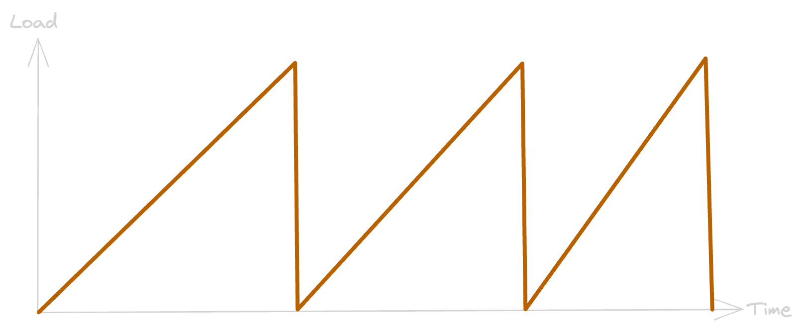

### Test en isolement



Note:
Ce type de test est réalisé sur un _banc de test_ (pour un cas isolé) en pratiquant une 
répétition d'exécutions.

<!--v-->

### Microbenchmark

Outils utilisé: [Open JDK JMH](https://github.com/openjdk/jmh)

Note: JMH est un outil proposé et maintenu par OpenJDK

<!--v-->

### Concepts

Choix du type d'analyse

Définition d'un `State`

Ecriture du code à tester

Ecriture du `Benchmark`

<!--v-->

#### Types d'analyses

- Throughput: ops/time
- AverageTime: time/op
- SampleTime: sampling exec time
- SingleShotTime: exec once

Note:

- Throughput: pour un temps donné, compte le nombre d'exec de la fonction
- AverageTime: pour un nombre d'exécution donné, mesure le temps
- SampleTime: exécute la fonction en continue et échantillon de temps
- SingleShotTime: exécute une fois la fonction, idéal pour exec à froid

<!--v-->

#### State

```java [1|3|5-11]
@State(Scope.Benchmark)
public static class ExecutionPlan {
    public List<Brand> brandList = new ArrayList<>(10000);

    @Setup
    public void setup() throws IOException {
        for (int i = 0; i < 10000; i++) {
            Brand builtBrand = buildBrand();
            brandList.add(builtBrand);
        }
    }
}
```

Note: 

- Petite annotation qui va bien
- Une petite liste dans laquelle nous allons chercher
- Une fonction pour remplir notre liste

<!--v-->

#### Code à tester

```java [1-5|7-14]
private Brand findBrandStream(List<Brand> brandList, Integer id) {
    return brandList.stream().filter(brand -> brand.id().equals(id))
            .findFirst()
            .orElse(null);
}

private Brand findBrandFor(List<Brand> brandList, Integer id) {
    for (Brand brand : brandList) {
        if (brand.id().equals(id)) {
            return brand;
        }
    }
    return null;
}
```

Note:

- Une fonction qui utilise une `stream` pour chercher par ID dans la `List`
- Une fonction qui utilise une boucle `ForEach` pour chercher par ID dans la `List`

<!--v-->

#### Définition du benchmark 1/2

```java [1|2,4|3|5-10]
@Benchmark
@OperationsPerInvocation(10000)
public void findBrandStream(Blackhole blackhole, ExecutionPlan plan) {
    for (int i = 0; i < 10000; i++) {
      blackhole.consume(
        findBrandStream(
          plan.brandList, 
          plan.brandList.get(random.nextInt(10000)).id()
        )
      );
    }
}
```

<!--v-->

#### Définition du benchmark 2/2

```java [3|6]
@Benchmark
@OperationsPerInvocation(10000)
public void findBrandFor(Blackhole blackhole, ExecutionPlan plan) {
    for (int i = 0; i < 10000; i++) {
      blackhole.consume(
        findBrandFor(
          plan.brandList, 
          plan.brandList.get(random.nextInt(10000)).id()
        )
      );
    }
}
```

Note:

<!--v-->

#### Exécution

```
# Blackhole mode: compiler (auto-detected, use -Djmh.blackhole.autoDetect=false to disable)
# Warmup: 5 iterations, 10 s each
# Measurement: 5 iterations, 10 s each
# Timeout: 10 min per iteration
# Threads: 1 thread, will synchronize iterations
# Benchmark mode: Throughput, ops/time
# Benchmark: org.example.StreamVsForMain.findBrandFor

# Run progress: 0,00% complete, ETA 00:03:20
# Fork: 1 of 1
# Warmup Iteration   1: 76239,113 ops/s
# Warmup Iteration   2: 76767,384 ops/s

Iteration   1: 76972,113 ops/s
Iteration   2: 76562,211 ops/s
```

<!--v-->

#### Résultats

```
Benchmark                         Mode  Cnt      Score      Error  Units
StreamVsForMain.findBrandFor     thrpt    5  76758,517 ±  559,708  ops/s
StreamVsForMain.findBrandStream  thrpt    5  43736,684 ± 1081,065  ops/s
```
