## Les tests de performance


note:

authors:
- S.LAVAZAIS
- D.SIX

Sources:
- [Wikipedia - software performance testing](https://en.wikipedia.org/wiki/Software_performance_testing)

<!--v-->

## Introduction - Sommaire

1. Les tests performance, qu'est-ce que c'est ?
2. Quel type de test pratiquer?
3. Java Microbenchmark Harness
4. Taurus

Note:
Pour cette présentation, nous allons voir grossièrement ce que sont les tests de performance, et nous allons faire deux focus sur des sous-domaine de test qui sont le micro benchmark et les tests de charge.

 - Le focus sur le micro-benchmark se fera avec Java Microbenchmark Harness (JMH) et sera présenté par Douglas Six.
 - Le focus sur les tests de charge se fera avec Taurus et sera présenté par Sylvain Lavazais.

Mais tout d'abord, parlons des tests de performance...

1. Les testes de performance, qu'est-ce que c'est ?
2. Quel type de test pratiquer?
   1. test en isolement
   2. test de charge
   3. test en stress
   4. test de pic
   5. test au limites
   6. test d'endurance
3. Tests en isolement avec Java Microbenchmark Harness
   1. Demo Isolement
4. Tests de charge avec Taurus 
   1. Demo de charge
5. Merci !

<!--h-->

### Les testes performance, qu'est-ce que c'est ?

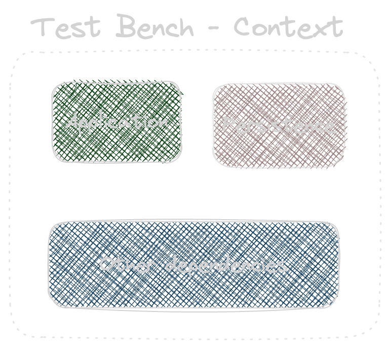

Note:
Les tests de performances, c'est la capacité à mettre une application et toutes ses dépendances dans un context virtuel 
ou réel et observer comment ces composants se comportent dans des conditions de stress / charge / etc.

On peut ainsi en déterminer des axes d'amélioration.

<!--v-->

<!-- .slide: data-auto-animate -->
### Les testes performance, qu'est-ce que c'est ? 

<div style="display: flex">
   <div>
      <div style="font-size: xx-large">temps de réponse</div>
      
   </div>
   <div>
      <div style="font-size: xx-large">les resources utilisées</div>
      
   </div>
   <div>
      <div style="font-size: xx-large">l'adaptation</div>
      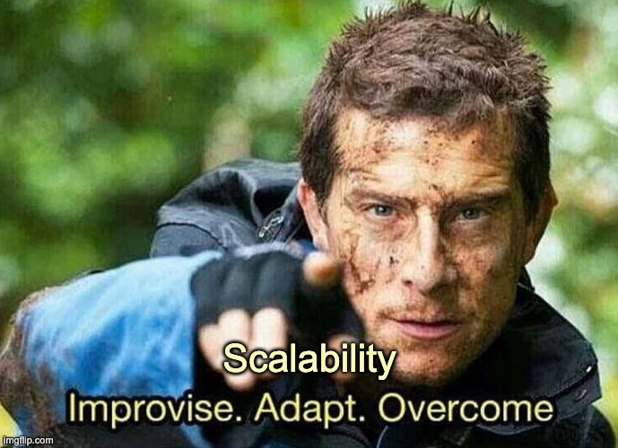
   </div>
</div>

Note:
Voici les principals métriques qu'un test de performance évalue :
 - Le temps de réponse global (sur le pourcentage de toute les réponses) et à un instant T.
 - La quantité de resources utilisées
 - Mesure de la capacité d'adaptation / de la scalabilité
<!--v-->

<!-- .slide: data-auto-animate -->
### Les testes performance, qu'est-ce que c'est ?

<div style="display: flex">
   <div>
      <div style="font-size: xx-large">les coupûres</div>
      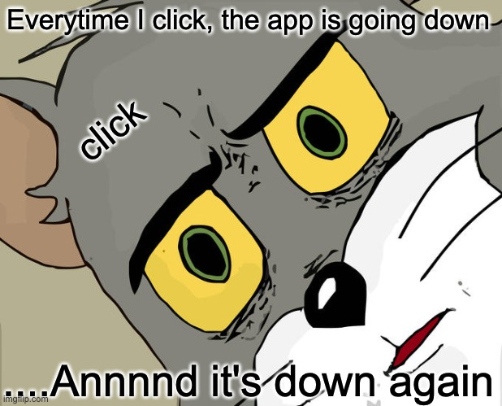
   </div>
   <div>
      <div style="font-size: xx-large">bug / bottleneck</div>
      
   </div>
   <div>
      <div style="font-size: xx-large">la sécurité</div>
      
   </div>
</div>

Note:
Les tests de performance permet également de : 
  - De prévenir les coupures dû à la charge
  - De détecter les bugs non couverts / les goulots d'étranglement
  - D'atténuer les failles de sécurités
<!--v-->

### Quel type de test pratiquer?

1. test en isolement
2. test de charge
3. test en stress
4. test de pic
5. test aux limites
6. test d'endurance

Note:
Voici les différents tests de performance praticable ainsi que les diférences entre eux.

<!--v-->

### Test en isolement


Note:
Douglas

Ce type de test est réalisé sur un _banc de test_, c'est à dire un sous ensemble de l'application finale,
par example la fonctionalité d'ajout au panier mais sans la partie navigation dans le site...
Le test sera réalisé en pratiquant une répétition d'exécutions. 

<!--v-->

### Test de charge

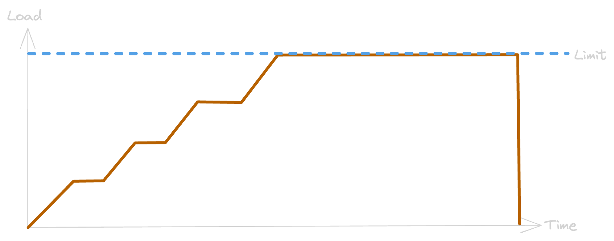

Note:
Sylvain

Le test de charge est la forme la plus simple et connu pour tester une application.
L'objectif est de vérifier si l'application est capable de gérer les limites de temps de réponse / consommation 
ressources qui ont été décider préalablement (par exemple au travers d'un SLA, Service Level Agreements)
L'infrastructure est également sous-monitoring durant cette phase de test.

Ce type de test peut être utilisé comme un test de qualité d'une release à une autre, ainsi qu'un objectif à maintenir.

<!--v-->

### Test en stress (surcharge)

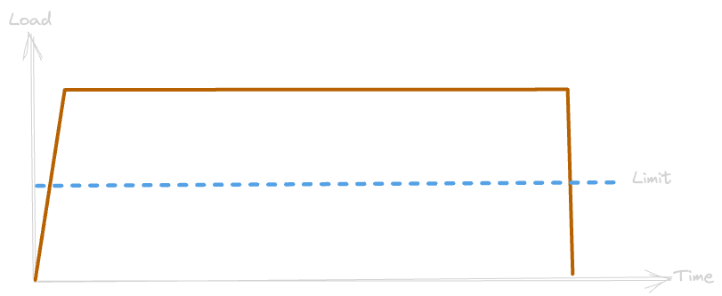

Note:
Douglas

Ce type de test vise à comprendre comment l'application va se comporter face à une charge plus importante
que le cas nominal (x2 à x4) en utilisant la même infra que celle ciblé. On identifie ainsi les endroits de 
l'application où se produiront les premières erreurs, ainsi que les temps de réponse en dehors des exigences.


<!--v-->

### test de pic de charge

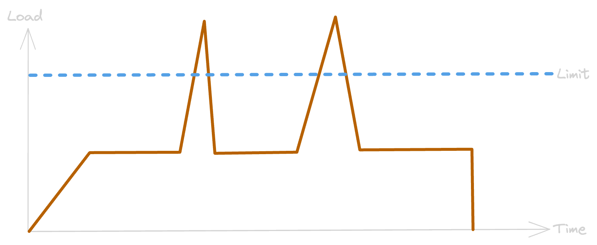

Note:
Sylvain

Le test de pic vise à déterminer les problèmes de performance quand un changement de contexte se produit sur 
l'application testée, que ce soit une montée en charge soudaine du nombre d'utilisateurs qui se connecte en même temps 
ou à l'inverse une baisse de charge.

<!--v-->

### Test aux limites

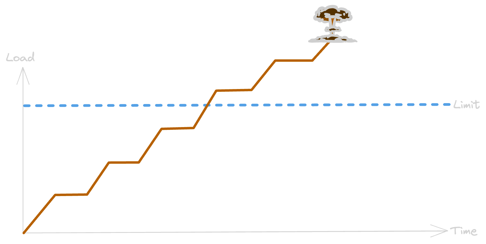

Note:
Douglas

Le test au limites permet d'évaluer le point de rupture de l'application.
On parle souvent de test de capacité car il est utile pour déterminer si le SLA est judicieux pour l'application testée.

L'objectif visé est la rupture de l'application pour une infrastructure donnée. La rupture étant caractérisée par des données
définies en accord avec le client par ex: "au doigt mouillé la limite sera de 70% des réponses KO", ou bien un temps de réponse de 10s
par page... La monté en charge est ici lente et le test peut être long.

<!--v-->

### Test d'endurance

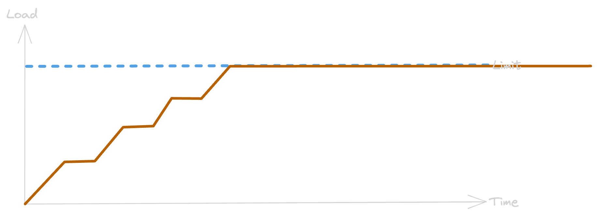

Note:
Sylvain

Le test d'endurance consiste à maintenir une charge pendant un temps extrêmement long et permet déterminer si 
l'application testée est capable de supporter un tel scénario.
Comme les tests de charge l'infrastructure est également sous-monitoring durant cette phase de test.

le critère determinant c'est le temps du test (il est trés long, le faire apparaitre sur le graph)

<!--h-->

### Microbenchmark

Outils utilisé: [Open JDK JMH](https://github.com/openjdk/jmh)

Note: 
Pour illustré ce test, je vous propose de comparer la recherche d'un objet dans une liste en comparant 
deux méthodes différentes : 
  La boucle célèbre **FOR**
  vs 
  L'illustre **Stream** API de Java
Pour cela nous utiliserons JMH. C'est un outil proposé et maintenu par OpenJDK

<!--v-->

### Concepts

Type d'analyse

Définition d'un `State`

Écriture du code à tester

<!--v-->

#### Les types d'analyses

- Throughput: ops/time
- AverageTime: time/op
- SampleTime: sampling exec time
- SingleShotTime: exec once

Note:

- Throughput: pour un temps donné, compte le nombre d'exec de la fonction
- AverageTime: pour un nombre d'exécution donné, mesure le temps
- SampleTime: exécute la fonction en continue et échantillon de temps
- SingleShotTime: exécute une fois la fonction, idéal pour exec à froid

<!--v-->

#### State

```java [3|1|5-11]
@State(Scope.Benchmark)
public static class ExecutionPlan {
    public List<Brand> brandList = new ArrayList<>(10000);

    @Setup
    public void setup() throws IOException {
        for (int i = 0; i < 10000; i++) {
            Brand builtBrand = buildBrand();
            brandList.add(builtBrand);
        }
    }
}
```

Note: 

- Une liste contenant un nombre certain de valeurs différentes
- Petite annotation qui va bien
- Une fonction pour remplir notre liste. _Remarque :_ la fonction 'buildBrand()' 
  n'importe pas ici

<!--v-->

#### Code à tester

```java [1-5|7-14]
private Brand findBrandStream(List<Brand> brandList, Integer id) {
    return brandList.stream().filter(brand -> brand.id().equals(id))
            .findFirst()
            .orElse(null);
}

private Brand findBrandFor(List<Brand> brandList, Integer id) {
    for (Brand brand : brandList) {
        if (brand.id().equals(id)) {
            return brand;
        }
    }
    return null;
}
```

Note:

- Une fonction qui utilise une 'stream' pour chercher par ID dans la 'List'
- Une fonction qui utilise une boucle 'ForEach' pour chercher par ID dans la 'List'

<!--v-->

#### Définition du benchmark 1/2

```java [3|2,4|5-10]
@Benchmark
@OperationsPerInvocation(10000)
public void findBrandStream(Blackhole blackhole, ExecutionPlan plan) {
    for (int i = 0; i < 10000; i++) {
      blackhole.consume(
        findBrandStream(
          plan.brandList, 
          plan.brandList.get(random.nextInt(10000)).id()
        )
      );
    }
}
```

Note: 
Fonction de recherche par Stream, deux paramètres:
- Blackhole (pour éviter le "dead code eviction" du compilateur)
- Plan (Context)

Une boucle itérant un certain nombre de fois sur le code à analyser. 
On passe au Framework se nombre pour ses calculs

Le résultat de la fonction est envoyé dans le Blackhole, 

L'ID de l'objet à trouver est pris de façon aléatoire dans la liste

<!--v-->

#### Définition du benchmark 2/2

```java [3|6]
@Benchmark
@OperationsPerInvocation(10000)
public void findBrandFor(Blackhole blackhole, ExecutionPlan plan) {
    for (int i = 0; i < 10000; i++) {
      blackhole.consume(
        findBrandFor(
          plan.brandList, 
          plan.brandList.get(random.nextInt(10000)).id()
        )
      );
    }
}
```

Note:

Code très semblable au code précédent, mais cette fois on appelle l'autre fonction :) 

<!--v-->

#### Exécution

```shell [2,11-13|3,15-17]
# Blackhole mode: compiler (auto-detected, use -Djmh.blackhole.autoDetect=false to disable)
# Warmup: 3 iterations, 10 s each
# Measurement: 3 iterations, 10 s each
# Timeout: 10 min per iteration
# Threads: 1 thread, will synchronize iterations
# Benchmark mode: Throughput, ops/time
# Benchmark: org.example.StreamVsForMain.findBrandFor

# Run progress: 0,00% complete, ETA 00:03:20
# Fork: 1 of 1
# Warmup Iteration   1: 76239,113 ops/s
# Warmup Iteration   2: 76767,384 ops/s
# Warmup Iteration   3: 76239,113 ops/s

Iteration   1: 76972,113 ops/s
Iteration   2: 76562,211 ops/s
Iteration   3: 76972,113 ops/s
```

Note:

En Java le code est compilé mais pas trop. Une phase importante pour les applications Java 
a lieu à l'exécution, l'optimisation. Celle-ci est effectuée par le JIT Compiler.
Pour éviter de mesurer ce travail d'optimisation, le Framework effectue quelques tours de chauffe

Puis mesure réellement. Attention à éviter tout ce qui peut perturber le test si vous 
l'exécuter sur votre machine (l'agenda, les mails, les notifications Slack)

<!--v-->

#### Résultats

```
Benchmark                         Mode  Cnt      Score      Error  Units
StreamVsForMain.findBrandFor     thrpt    3  76758,517 ±  559,708  ops/s
StreamVsForMain.findBrandStream  thrpt    3  43736,684 ± 1081,065  ops/s
```

Note:

Une fois les mesures effectuées JMH vous sort un joli petit tableau de comparaison.

L'erreur que l'on voit ici c'est "l'interval de confiance", c'est à dire l'écart de temps 
autour de la moyenne (score) dans lequel se trouve 99% des temps mesurés.

<!--h-->

<!-- .slide: data-auto-animate -->
### Taurus


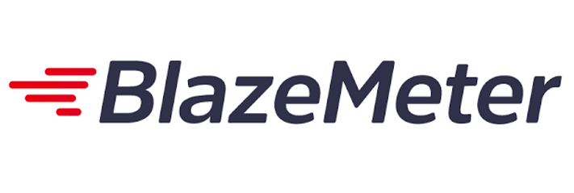

Note:
Taurus est un kit de développement qui permet à la fois :
 - De pouvoir exécuter des tests avec plusieurs frameworks différents de test (sans qu'il y ait une grande différence dans l'implémentation des scénarios de tests)
 - De pouvoir exécuter des tests aussi bien en local que sur un cloud provider. (plateforme Blazemeter)

<!--v-->

<!-- .slide: data-auto-animate -->
### Taurus

in local-dev condition

```yaml
execution:
- concurrency: 100
  hold-for: 1h
  ramp-up: 15m
  scenario: scenario1
  steps: 10
  throughput: 2000
```

```yaml
scenarios:
  scenario1:
    requests:
    - body: [...]
      headers: [...]
      label: first_req
      method: GET
      url: https://api.publicapis.org/entries
```

Note:
Les tests de charge avec Taurus sont assez simple, ils sont constitué de deux parties :
 - la configuration de l'exécution
 - la configuration du/des scénario(s)

<!--v-->

<!-- .slide: data-auto-animate -->
### Taurus

in cloud condition

```yaml
execution:
- concurrency: 100
  hold-for: 1h
  ramp-up: 15m
  scenario: scenario1
  steps: 10
  throughput: 2000
  provisioning: cloud
  locations: 
    eu-central-1: 2
    eu-west-1: 2
```

```yaml
scenarios:
  scenario1:
    requests:
    - body: [...]
      headers: [...]
      label: first_req
      method: GET
      url: https://api.publicapis.org/entries
```

Note:
Les tests de charge avec Taurus sont assez simple, ils sont constitué de deux parties :
 - la configuration de l'exécution
 - la configuration du/des scénario(s)

<!--v-->

<!-- .slide: data-auto-animate -->
### Taurus

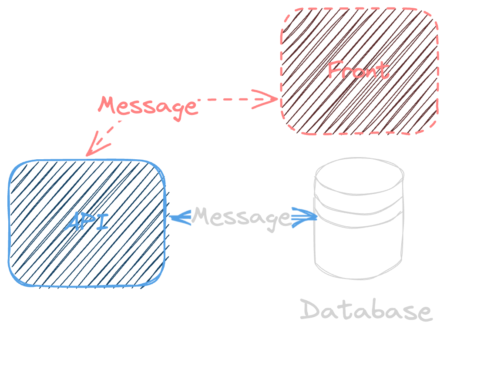

Note:
Pour notre petite démonstration, on va prendre l'exemple d'une API qui gère la déposition de données en amont d'un 
système d'information

<!--v-->

<!-- .slide: data-auto-animate -->
### Taurus

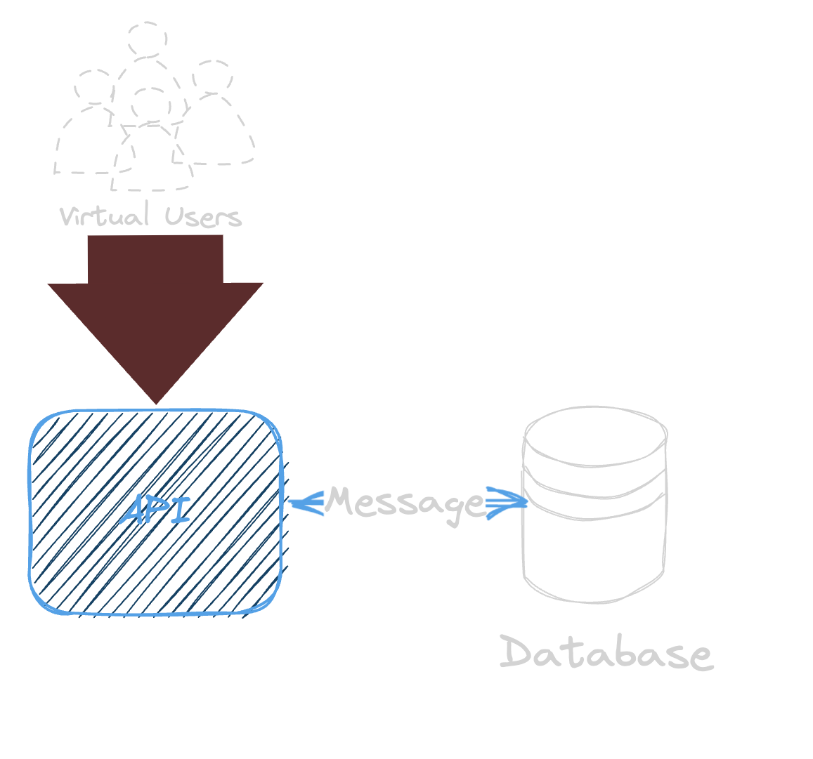

Note:
Tout d'abords les paramètres d'exécution qui gère donc la volumétrie et le temps d'exécution du scenario de test:
 - 100 utilisateurs
 - 2000 requêtes par secondes (total reparti sur les 100 utilisateurs)
 - sur 1 heure
 - 15 minutes de monté en charge

<!--v-->

<!-- .slide: data-auto-animate -->
### Taurus

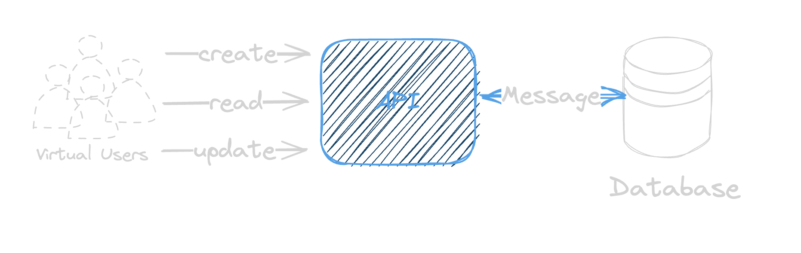

Note:
Pour tester notre API, on va donc avoir un scénario assez simple qui va simuler: 
1. un enregistrement d'une donnée
2. une lecture de ce nouvel enregistrement
3. une modification de ce nouvel enregistrement

Ce scénario sera exécuté par tous les utilisateurs virtuels

<!--v-->

<!-- .slide: data-auto-animate -->
### Taurus

Demo !

Note:
Dans cette demonstration, on fait :
1. lancer le scenario en local
2. on regarde rapidement les stats si tout semble ok
3. lancer le scenario en cloud
4. on va regarder le scenario en mode cloud et consulter les différents tableau de Blazemeter

<!--v-->

<!-- .slide: data-auto-animate -->
### Taurus


Note:
Lancement de Taurus en local

<!--v-->

<!-- .slide: data-auto-animate -->
### Taurus


Note:
Lancement de d'un test sur blazemeter (en mode cloud)

<!--h-->

### Questions ?

<!--v-->

### Merci !

Présenté par :

<div style="display: flex">
  <div style="margin-right: 1em; flex-grow: 1;">
    <br/>
    Douglas SIX
  </div>
  <div style="margin-left: 1em; flex-grow: 1;">
    <br/>
  </div>
  <div style="margin-left: 1em; flex-grow: 1;">
    <br/>
    Sylvain LAVAZAIS
  </div>
</div>


